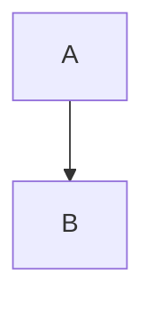

# インターフェース要件書

**システム名：マルチソース対応 RAG 基盤および Wiki 自動生成システム**

---

## 1. 概要

本ドキュメントは、システム内部で使用される主要なインターフェースの要件を定義する。

**役割分担:**
- 本ドキュメント: 内部インターフェースの要件（入出力、処理内容）
- [design.md](design.md): システム全体の設計方針、CLI仕様、非機能要件
- [database-schema.md](database-schema.md): データベーススキーマの詳細

**注:** 具体的な実装（型定義、メソッドシグネチャ等）は実装者に委ねる。

---

## 2. 基本方針

- **疎結合**: コンポーネント間の依存を最小限にする
- **テスタビリティ**: モックやスタブで置き換え可能にする
- **エラーハンドリング**: 標準の `error` 型を使用、必要に応じてカスタムエラー型でラップ
- **コンテキスト管理**: 長時間実行される処理は `context.Context` を受け取る
- **標準ライブラリ優先**: `log/slog` など、不要な抽象化は避ける

---

## 3. 主要インターフェース要件

### 3.1 プロダクト管理

**目的:** 複数の情報ソースをグループ化するプロダクト単位を管理する

**必要な操作:**
- 作成: プロダクト名、説明を登録
- 更新: プロダクトの基本情報を更新
- 取得: ID、名前で取得
- 一覧取得: 全プロダクトを取得
- 削除: カスケード削除（内部API専用、CLI公開不要）

**入出力:**
- 入力: プロダクト名、説明（オプション）
- 出力: プロダクトID、名前、説明、作成・更新日時

**使用例:**
- ECサイトプロダクト = バックエンドGit + フロントエンドGit + インフラGit + Confluence + Redmine

---

### 3.2 ソース管理

**目的:** 情報ソース（Git、Confluence、PDF等）のメタデータを管理する

**必要な操作:**
- Upsert（登録・更新）: 名前で検索し、存在すれば更新、なければ新規作成
- 取得: ID、名前で取得
- 一覧取得: 全ソース、またはプロダクト配下のソースを取得
- 削除: カスケード削除（内部API専用、CLI公開不要）

**入出力:**
- 入力: ソース名、ソースタイプ（git/confluence/pdf/redmine/notion/local）、プロダクトID（オプション）、メタデータ（JSONB）
- 出力: ソースID、名前、ソースタイプ、プロダクトID、メタデータ、作成・更新日時

**メタデータ例（source_type別）:**
- `git`: `{"url": "git@gitlab.com:company/myapp.git", "default_branch": "main"}`
- `confluence`: `{"space_key": "DEV", "base_url": "https://confluence.example.com"}`
- `pdf`: `{"directory_path": "/var/lib/dev-rag/pdfs/product-specs"}`
- `redmine`: `{"project_id": "myapp", "base_url": "https://redmine.example.com"}`

**初期フェーズ:** Gitソースのみを実装

---

### 3.3 ソーススナップショット管理

**目的:** ソースの特定バージョン時点を管理する

**必要な操作:**
- 作成: 同じバージョン識別子が存在する場合は更新
- 取得: ID、ソースID + バージョン識別子、ソースID + 参照名で取得
- 最新インデックス済みスナップショット取得: ソースID + 参照名で `indexed=true` の最新を返す
- インデックス完了マーク: `indexed=true` と `indexed_at` を更新

**入出力:**
- 入力: ソースID、バージョン識別子、参照名（オプション）
- 出力: スナップショットID、バージョン識別子、参照名、インデックス済みフラグ、インデックス完了日時、作成日時

**バージョン識別子の例:**
- Git: コミットハッシュ（例: `abc123def456...`）
- Confluence: ページバージョン（例: `v42`）
- PDF: ファイルハッシュ（例: `sha256:abcd1234...`）
- Redmine: 更新タイムスタンプ（例: `2025-11-16T10:00:00Z`）

---

### 3.4 インデックス処理

**目的:** 情報ソースをインデックス化する

**必要な機能:**
1. **ソースインデックス化**
   - 入力: ソース名、プロダクト名（オプション）、参照、強制初期化フラグ
   - 出力: スナップショットID、バージョン識別子、処理ファイル数、作成チャンク数、処理時間、エラー

2. **ファイルインデックス化**
   - 入力: スナップショットID、ファイルパス、内容、コンテンツタイプ（MIMEタイプ）
   - 出力: ファイルID、作成チャンク数

**処理要件（Gitソースの場合）:**
- ソース自動登録・更新（Upsert）
- Git clone/pull
- ファイル一覧取得（除外ルール適用: .gitignore → .devragignore）
- チャンク化
- Embedding生成
- DB保存
- PostgreSQLアドバイザリロックで排他制御

**処理要件（将来の拡張: Confluence/PDF/Redmine等）:**
- 各ソースタイプに応じたデータ取得処理
- 統一されたファイル/ドキュメント抽出インターフェース
- 共通のチャンク化・Embedding処理

**インデックスモード:**
- デフォルト: 前回スナップショットがあれば差分更新、なければフルインデックス
- 強制初期化: 既存データを削除して強制的にフルインデックス

**差分更新の仕組み:**
- 同一ソース・参照で最後に成功したスナップショットを検索
- ファイルの `content_hash` で変更検出
- 差分判定の詳細:
  - **新規ファイル**: 前回に存在しない → インデックス作成
  - **削除ファイル**: 新版に存在しない → cascade削除（files削除→chunks/embeddings自動削除）
  - **変更ファイル**: content_hashが異なる → chunks/embeddings削除後、再インデックス
  - **リネーム**: 削除+追加として扱う（ハッシュ一致でも再インデックス）

---

### 3.5 チャンク化

**目的:** ファイルを小さな単位に分割する

**必要な機能:**
- 入力: テキスト内容、ファイルパス、言語種別（オプション）
- 出力: チャンク配列（序数、開始行、終了行、内容、トークン数）

**実装要件:**
- 開始行・終了行番号を記録
- オーバーラップ管理
- トークン数は推定値で可

**パラメータは design.md を参照**

---

### 3.6 Embedding生成

**目的:** テキストをベクトルに変換する

**必要な機能:**
1. **単一Embedding生成**
   - 入力: テキスト
   - 出力: ベクトル配列（float32）

2. **バッチEmbedding生成**
   - 入力: テキスト配列
   - 出力: ベクトル配列の配列

3. **メタ情報取得**
   - モデル名を返す
   - ベクトル次元数を返す

**実装要件:**
- OpenAI Embeddings API連携
- リトライ処理（429/500エラー時に最大3回、exponential backoff）

**設定値は design.md を参照**

---

### 3.7 ベクトル検索

**目的:** 意味的に類似したチャンクを検索する

**必要な機能:**
- 入力: プロダクト名またはソース名、クエリ文字列、取得件数、フィルタ条件、コンテキスト設定
- 出力: 検索結果配列、処理時間

**検索条件:**
- プロダクト名（プロダクト単位検索の場合、必須）
- ソース名（ソース単位検索の場合、必須）
- クエリ文字列（必須）
- 取得件数（デフォルト: 10）
- パスプレフィックス（オプション）
- コンテンツタイプフィルタ（MIMEタイプ: text/x-go, text/markdown等、オプション）
- 前後コンテキスト数（0-3）

**注:** 検索対象は常に各ソースの最新インデックス済みスナップショット

**検索結果に含める情報:**
- ファイルパス
- 開始行・終了行
- チャンク内容
- 類似度スコア（0.0-1.0）
- 前後のコンテキストチャンク（オプション）

**スコアリング仕様:**
- 算出式: `score = 1 - cosine_distance`
- 型: float64
- 範囲: 0.0（完全不一致）〜 1.0（完全一致）
- 並び順: スコア降順（デフォルト）

**コンテキスト設定:**
- デフォルト: 前1チャンク + 後1チャンク
- 設定範囲: 0〜3チャンク

**実装要件:**
- pgvectorのコサイン類似度検索
- インデックス済みスナップショットのみ対象
- フィルタ条件の効率的な適用

---

### 3.8 Wiki生成

**目的:** プロダクト単位でMarkdown形式のWikiを生成する

**必要な機能:**

1. **Wiki生成実行**
   - 入力: プロダクト名、出力ディレクトリ
   - 出力: 生成されたページ情報（ファイルパス、成功/失敗）、処理時間、エラー情報

**処理フロー:**

1. **コンテキスト準備:**
   - プロダクト情報を取得（名前、説明）
   - プロダクトに属する全ソースを取得
   - 各ソースの最新インデックス済みスナップショット情報を取得
     - **Gitソースの場合**: `sources.metadata.default_branch` で指定されたブランチが `git_refs` テーブルで指すスナップショットを取得。default_branchが未指定の場合は `main` を使用。
     - **Git以外のソースの場合**: 該当ソースの `indexed=true` のスナップショットを `indexed_at` 降順で取得し、最新のものを使用。
   - 最新バージョン情報を取得（バージョン識別子、日時等）

2. **対象ディレクトリの判定（features/用、Gitソースの場合）:**
   - プロダクト内の各Gitソース構造を解析し、主要ディレクトリを特定
   - 設定ファイルで明示的に指定することも可能

3. **ページ生成:**
   各ページ（index.md、architecture.md、features/<feature-name>.md）に対して以下を実行：

   - a. **ベクトル検索実行:**
     - ページの疑似クエリを使用してRAG検索
     - 検索オプション（パスフィルタ、コンテンツタイプフィルタ）を適用
     - 指定されたTop-K個のチャンクを取得

   - b. **コンテキスト構築:**
     - 取得したチャンクをファイルパス別にグループ化
     - 各ファイルパスをヘッダーとして整形
     - コンテキスト文字列を生成

   - c. **プロンプト生成:**
     - システムプロンプトを構築（プロダクト名を含む）
     - ユーザープロンプトを構築（コンテキスト + 疑似クエリ）

   - d. **LLM呼び出し:**
     - 設定されたLLMプロバイダー（OpenAI/Anthropic）とモデルを使用
     - Temperature: 0.2、Max Output Tokens: 2048
     - Response Format: markdown（OpenAI APIの場合）
     - ストリーミング無効（完全な応答を待つ）

   - e. **後処理:**
     - 生成されたMarkdownの基本的な検証
     - architecture.mdの場合はMermaid図の存在を確認

4. **ファイル出力:**
   - 出力ディレクトリの作成（存在しない場合）
   - UTF-8エンコーディングでファイル書き込み
   - 既存ファイルは常に上書き（再現性を最優先）
   - ファイルパーミッション: 644

5. **結果集計:**
   - 生成成功/失敗ページのカウント
   - 総処理時間の計算
   - エラーログの集約

**エラーハンドリング要件:**
- トークン制限超過: チャンク数を減らして再試行（最大3回）
- API エラー: 指数バックオフでリトライ（最大3回、1秒→2秒→4秒）
- ファイル書き込み失敗: エラーログを出力し該当ページをスキップ

**パフォーマンス要件:**
- ページ生成の逐次実行（シンプルな実装を優先）
- LLM呼び出しのレート制限: プロバイダーの制限に準拠

**再現性の保証:**
- 生成されたWikiは再生成のたびに上書きされる前提
- 人手による修正が必要な場合は別ブランチや補助ドキュメントに反映

---

### 3.9 LLM連携

**目的:** テキスト生成を行う（Wiki生成で使用）

**必要な機能:**

1. **テキスト生成（同期）**
   - 入力: プロンプト、システムプロンプト、生成パラメータ
   - 出力: 生成テキスト、使用トークン数
   - Wiki生成で使用

**生成パラメータ:**
- Temperature: 0.2（Wiki生成用）
- MaxTokens: 2048
- TopP: 0.8（OpenAI用）

**プロバイダー別実装要件:**

1. **OpenAI:**
   - モデル: `gpt-4-turbo-preview`, `gpt-4o` 等
   - 設定: Temperature, MaxTokens, TopP
   - 環境変数: `OPENAI_API_KEY`

2. **Anthropic Claude:**
   - モデル: `claude-3.5-sonnet`, `claude-3-opus` 等
   - 設定: Temperature, MaxTokens
   - 環境変数: `ANTHROPIC_API_KEY`
   - 特記事項: system promptとuser promptを明確に分離

**共通実装要件:**

- **リトライ処理:**
  - 429エラー（レート制限）: 指数バックオフで最大3回リトライ
  - 500/503エラー（サーバーエラー）: 1秒待機後リトライ（最大3回）
  - その他エラー: リトライせず即座にエラー返却

- **タイムアウト対応:**
  - 同期呼び出し: 60秒タイムアウト

- **エラーハンドリング:**
  - APIキー不正: 明確なエラーメッセージを返す
  - トークン超過: エラーメッセージに推奨トークン数を含める
  - ネットワークエラー: リトライ後も失敗した場合は詳細を記録

**ログ出力要件:**
- リクエスト開始: プロバイダー、モデル、プロンプト長
- リクエスト完了: 生成トークン数、処理時間、エラー有無
- リトライ実行: リトライ回数、待機時間、エラー内容

---

## 4. HTTPエンドポイント仕様

### 4.1 プロダクト一覧取得

**エンドポイント:**
```
GET /api/v1/products
```

**レスポンス (200 OK):**
```json
[
  {
    "id": "550e8400-e29b-41d4-a716-446655440000",
    "name": "ecommerce",
    "description": "ECサイトプロダクト",
    "sourceCount": 5,
    "createdAt": "2025-11-01T00:00:00Z",
    "lastIndexedAt": "2025-11-16T10:05:23Z",
    "wikiGeneratedAt": "2025-11-16T10:06:00Z"
  }
]
```

### 4.2 ソース一覧取得

**エンドポイント:**
```
GET /api/v1/products/:productID/sources
```

**レスポンス (200 OK):**
```json
[
  {
    "id": "550e8400-e29b-41d4-a716-446655440001",
    "productID": "550e8400-e29b-41d4-a716-446655440000",
    "name": "backend-api",
    "sourceType": "git",
    "metadata": {
      "url": "git@gitlab.com:company/backend.git",
      "default_branch": "main"
    },
    "createdAt": "2025-11-01T00:00:00Z",
    "lastIndexedAt": "2025-11-16T10:05:23Z"
  }
]
```

### 4.3 gitソースインデックス更新（非同期）

**エンドポイント:**
```
POST /api/v1/index/git
```

**リクエストボディ:**
```json
{
  "url": "git@gitlab.com:company/backend.git",
  "product": "ecommerce",
  "ref": "main",
  "forceInit": false,
  "generateWiki": true
}
```

**フィールド説明:**
- `url` (string, required): GitリポジトリURL
- `product` (string, required): プロダクト名（存在しない場合は自動作成）
- `ref` (string, optional): ブランチ名またはタグ名（省略時はリモートのdefault_branch）
- `forceInit` (boolean, optional): 強制的にフルインデックスを実行するか（デフォルト: false）
- `generateWiki` (boolean, optional): インデックス完了後にWikiを自動生成するか（デフォルト: false）

**レスポンス (202 Accepted):**
```json
{
  "jobID": "550e8400-e29b-41d4-a716-446655440000",
  "status": "running"
}
```

**エラーレスポンス:**
- 404: ソースが見つからない
- 400: 不正なリクエスト
- 401: 認証エラー
- 500: サーバ内部エラー

### 4.4 Wiki生成（非同期、プロダクト単位のみ）

**エンドポイント:**
```
POST /api/v1/wiki/generate
```

**リクエストボディ:**
```json
{
  "productName": "ecommerce",
  "outputDir": "/var/lib/dev-rag/wikis/ecommerce"
}
```

**説明:**
- `productName` (string, required): プロダクト名（CLI/CIと同じ識別子）
- `outputDir` (string, optional): デフォルト以外の出力先を指定したい場合に利用。
- プロダクトに属する各ソースの最新インデックス済みスナップショットを使用してWikiを生成。

**レスポンス (202 Accepted):**
```json
{
  "jobID": "550e8400-e29b-41d4-a716-446655440001",
  "status": "running"
}
```

### 4.6 ジョブステータス確認

**エンドポイント:**
```
GET /api/v1/jobs/:jobID
```

**レスポンス (200 OK):**
```json
{
  "jobID": "550e8400-e29b-41d4-a716-446655440000",
  "targetType": "source",
  "targetName": "backend-api",
  "jobType": "index",
  "status": "completed",
  "startedAt": "2025-11-16T10:00:00Z",
  "endedAt": "2025-11-16T10:05:23Z",
  "error": ""
}
```

**フィールド説明:**
- `targetType`: "product" または "source"（Wiki生成の場合は常に"product"）
- `targetName`: プロダクト名またはソース名

**status値:**
- `running`: 実行中
- `completed`: 完了
- `failed`: 失敗

**jobType値:**
- `index`: インデックス更新
- `wiki`: Wiki生成

**エラー時のレスポンス:**
```json
{
  "jobID": "...",
  "status": "failed",
  "error": "OpenAI API rate limit exceeded"
}
```

### 4.5 Wiki情報取得（プロダクト単位のみ）

**エンドポイント:**
```
GET /api/v1/products/:productID/wiki
```

**レスポンス (200 OK):**
```json
{
  "generatedAt": "2025-11-16T10:06:00Z",
  "fileCount": 5
}
```

### 4.6 Wikiファイル一覧取得（プロダクト単位のみ）

**エンドポイント:**
```
GET /api/v1/products/:productID/wiki/files
```

**レスポンス (200 OK):**
```json
[
  "index.md",
  "architecture.md",
  "features/auth.md",
  "features/payment.md"
]
```

### 4.7 Wikiファイル取得（プロダクト単位のみ）

**エンドポイント:**
```
GET /api/v1/products/:productID/wiki/files/:path
```

**例:**
```
GET /api/v1/products/550e8400-e29b-41d4-a716-446655440000/wiki/files/index.md
GET /api/v1/products/550e8400-e29b-41d4-a716-446655440000/wiki/files/features/auth.md
```

**レスポンス (200 OK):**
```
Content-Type: text/markdown; charset=utf-8

# Architecture

このドキュメントではシステムアーキテクチャを説明します。


```

### 4.8 認証

すべてのエンドポイントは Bearer Token 認証が必要。

**リクエストヘッダ:**
```
Authorization: Bearer <token>
```

トークンは環境変数 `DEVRAG_API_TOKEN` で設定。

### 4.9 エラーレスポンス

**形式:**
```json
{
  "error": "エラーメッセージ",
  "code": "ERROR_CODE"
}
```

**エラーコード:**
- `PRODUCT_NOT_FOUND`: プロダクトが見つからない (404)
- `SOURCE_NOT_FOUND`: ソースが見つからない (404)
- `JOB_NOT_FOUND`: ジョブが見つからない (404)
- `WIKI_NOT_FOUND`: Wikiが見つからない (404)
- `FILE_NOT_FOUND`: ファイルが見つからない (404)
- `INVALID_REQUEST`: 不正なリクエスト (400)
- `UNAUTHORIZED`: 認証エラー (401)
- `INTERNAL_ERROR`: サーバ内部エラー (500)

### 4.10 JSON命名規約

Go命名規約に準拠：
- 頭字語は大文字: `jobID`, `productID`, `sourceID`, `apiKey`, `baseURL`
- それ以外はキャメルケース: `productName`, `sourceName`, `sourceType`, `versionIDentifier`, `generateWiki`

---

## 5. エラーハンドリング要件

**標準エラー:**
- プロダクト未検出
- ソース未検出
- スナップショット未検出
- スナップショット未インデックス
- インデックスロック取得失敗
- チャンク化失敗
- Embedding生成失敗
- 検索失敗
- Wiki生成失敗

**エラー処理方針:**
- エラーは標準の `error` 型で返す
- 必要に応じてカスタムエラー型でラップ
- エラーチェーンで情報を保持

---

## 6. ロギング要件

**基本方針:**
- 標準ライブラリの `log/slog` を使用
- 構造化ログ（JSON形式）
- レベル: DEBUG, INFO, WARN, ERROR
- 出力先: stdout

**ログに含める情報:**
- タイムスタンプ、ログレベル、メッセージ
- コンテキスト情報（プロダクト名、ソース名、バージョン識別子、ファイルパス、処理時間、エラー詳細など）

**環境変数:**
- 設定は .env ファイルまたは環境変数から読み込む
- godotenv ライブラリを使用して .env を読み込み

**詳細は design.md を参照**

---

## 7. 将来拡張の考慮事項

### 7.1 MCP サーバ

**インターフェース要件:**
- ツール定義（名前、説明、入力スキーマ）
- ツール実行（入力→出力）
- JSON-RPC over stdioプロトコル対応

**提供ツール:**
- `rag-search`: ベクトル検索を実行（プロダクトまたはソース単位）
- `get-file`: ファイル内容を取得
- `list-products`: プロダクト一覧を取得
- `list-sources`: ソース一覧を取得

**設計方針:**
- 検索APIを内部インターフェースとして共通化
- MCPサーバはCLIと同じロジックを再利用

### 7.2 RAG チャット API

**インターフェース要件:**
- セッション作成・取得
- メッセージ送信・履歴取得
- ストリーミング対応（Server-Sent Events）

**エンドポイント:**
- POST /api/v1/chat/sessions
- GET /api/v1/chat/sessions/:id
- POST /api/v1/chat/sessions/:id/messages
- GET /api/v1/chat/sessions/:id/messages

---

## 8. まとめ

本ドキュメントでは、以下のインターフェース要件を定義した：

1. プロダクト管理、ソース管理、ソーススナップショット管理
2. インデックス処理（チャンク化、Embedding生成）
3. ベクトル検索（プロダクト単位/ソース単位）
4. Wiki生成（プロダクト単位/ソース単位）、LLM連携
5. HTTPエンドポイント（プロダクト/ソース対応）
6. エラーハンドリングとロギング
7. 将来拡張（MCP、RAG チャット API）

**実装時の注意:**
- 本ドキュメントは要件を示すものであり、具体的な実装方法は実装者に委ねる
- インターフェースの設計は、テスタビリティと拡張性を重視すること
- 標準ライブラリを活用し、不要な抽象化は避けること
- パラメータ値やCLI仕様など、重複する情報は [design.md](design.md) を参照すること
