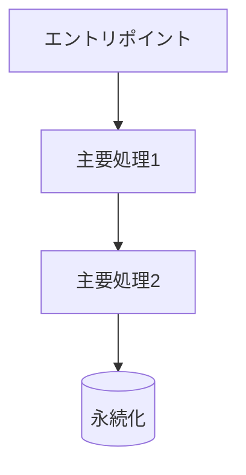
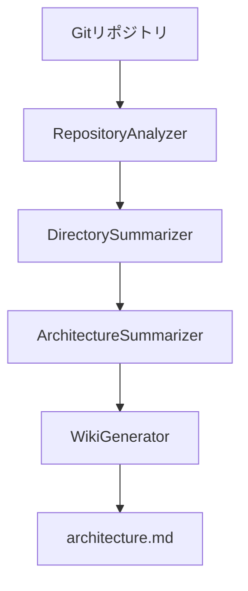
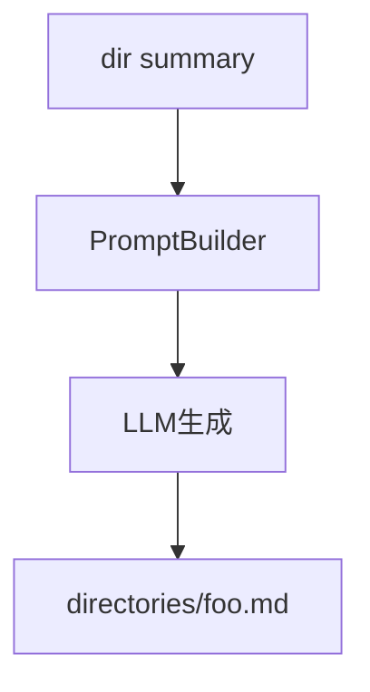

# アーキテクチャ理解Wiki生成用プロンプト（再設計版）

このテンプレートは、`architecture-understanding-wiki-system` がLLMに渡すプロンプトの再設計版です。セクション構造・具体例・制約条件を明示し、再利用しやすくしています。

---

## 1. 目的
- リポジトリ全体のアーキテクチャを日本語Markdownで要約し、Mermaid図を含むWikiページを安定して生成させる。
- 階層的要約（architecture/directory/file）とRAG検索結果を組み合わせ、ハルシネーションを抑制する。

## 2. 入力コンテキスト（プレースホルダ）
- `{{repository_stats}}`: 総ディレクトリ数・総ファイル数などの統計。
- `{{architecture_summaries}}`: architecture_summariesテーブルから取得した概要/技術スタック/データフロー/コンポーネント要約（空なら明示）。
- `{{rag_results}}`: RAG検索結果。各要素は `{path, content, score}` を含む。
- `{{pseudo_query}}`: 擬似クエリ文字列。

## 3. 出力セクション構造（順序固定）
1. システム概要
2. アーキテクチャパターン
3. 主要コンポーネント
4. データフロー（必ずMermaid 1つ以上）
5. 技術スタック
6. 根拠となるファイル/要約（バッククォート付きパス列挙）

## 4. 制約条件
- 言語: 日本語。Markdownのみ。箇条書きは短文で簡潔に。
- 事実ソース: `{{architecture_summaries}}` と `{{rag_results}}` のみを根拠に記述。足りない情報は「不明」と明示。
- Mermaid: `flowchart TD` または `sequenceDiagram` を使用。ノードは12個以内。ラベルは20文字以内。
- ファイル参照: パスはバッククォートで囲む（例: `pkg/wiki/generator/prompt_builder.go`）。
- 長さ: 全文で1200語以内。各セクションは見出し直下に本文を置き、空のセクションを作らない。
- 禁止事項: TODO/仮置き表現、外部リンク、HTMLタグ、無根拠の推測。

## 5. プロンプト本文（テンプレート）
```text
あなたは技術ドキュメントの専門家です。以下のコンテキストだけを根拠に、アーキテクチャWikiページをMarkdownで作成してください。

<CONTEXT>
## リポジトリ統計
{{repository_stats}}

## アーキテクチャ要約
{{architecture_summaries}}

## RAG検索結果
{{rag_results}}

## ユーザークエリ（擬似）
{{pseudo_query}}
</CONTEXT>

出力要件:
- 以下のセクション構造・順序を厳守する。
- 内容はすべてコンテキストに基づく。欠けていれば「不明」と記載。

## システム概要
- 2〜3文でシステムの目的と全体像。

## アーキテクチャパターン
- 採用しているパターンやレイヤー分離を箇条書きで。

## 主要コンポーネント
- 3〜6個のコンポーネントを「名前: 役割」の形式で列挙。

## データフロー


## 技術スタック
- 言語 / フレームワーク / データストア / 外部サービスを短く列挙。

## 根拠となるファイル/要約
- `path`: どの情報を参照したかを1行ずつ列挙。
```

## 6. 出力例（サンプル）
```md
## システム概要
社内リポジトリのコードを解析し、階層的な要約を生成してMarkdownのWikiを出力するツールチェーン。アーキテクチャ要約・ディレクトリ要約・ファイル要約を再利用し、最小のLLM呼び出しで全体像を提示する。

## アーキテクチャパターン
- 分割統治された3層要約生成（File→Directory→Architecture）
- RAGで補助するハイブリッド生成

## 主要コンポーネント
- RepositoryAnalyzer: リポジトリ構造の収集と整形
- DirectorySummarizer: ディレクトリ要約を生成し階層構造を維持
- ArchitectureSummarizer: ディレクトリ要約を統合して全体像を生成
- WikiGenerator: 要約とRAG結果からMarkdownを出力

## データフロー


## 技術スタック
- Go, PostgreSQL + pgvector, OpenAI API, sqlc

## 根拠となるファイル/要約
- `pkg/wiki/generator/prompt_builder.go`: 出力セクションとRAG統合の仕様
- `docs/architecture-understanding-wiki-system.md`: 階層的要約の設計原則
```

---

## 7. 使用方法メモ
- PromptBuilderなどで`{{...}}`を適宜置換し、LLM呼び出しに渡す。
- Mermaidを含むため、生成後のMarkdownをプレビュー可能な環境で確認する。

---

# 付録: 他コンポーネント向けプロンプトテンプレート

以下は同ドキュメントで必要となる複数のLLMプロンプトを再設計したテンプレート群。すべて日本語/Markdown出力を前提とし、セクション構造・制約・サンプルを含む。

## A. ArchitectureSummarizer 用（summary_type=overview|tech_stack|data_flow|components）

**目的**: Directory要約を抽象化し、アーキテクチャ要約テーブルを生成。

**入力プレースホルダ**
- `{{summary_type}}`: 4種類のいずれか。
- `{{repository_stats}}`: ディレクトリ数/ファイル数など。
- `{{directory_summaries}}`: depth順に連結したディレクトリ要約Markdown。

**出力セクション（summary_type別）**
- overview: システム概要 / 主要機能 / アーキテクチャパターン
- tech_stack: 言語 / FW・ライブラリ / DB・ストレージ / 外部サービス
- data_flow: エントリーポイント / 処理フロー(3-5ステップ) / 永続化
- components: 主要コンポーネント / 関係性 / レイヤー構成

**制約**
- 根拠は`{{directory_summaries}}`のみ。不明点は「不明」。
- 箇条書きは5行以内。例やファイルパスは不要。
- 文字数上限: 900語。

**プロンプト本文**
```text
あなたはソフトウェアアーキテクトです。以下のディレクトリ要約だけを根拠に、`{{summary_type}}` に対応するアーキテクチャ要約をMarkdownで出力してください。

## リポジトリ統計
{{repository_stats}}

## 全ディレクトリ要約
{{directory_summaries}}

出力要件:
- summary_type={{summary_type}} に対応したセクション構造を守る。
- 根拠が無い場合は「不明」と明記。
- 簡潔な日本語で記述。
```

**出力例（overview）**
```md
### システム概要
Gitリポジトリを解析し、階層的な要約をDBへ格納する内部ツール。

### 主要機能
- ファイル要約の生成と保存
- ディレクトリ要約の階層的集約
- アーキテクチャ要約の作成とMermaid対応Wiki生成

### アーキテクチャパターン
- 分割統治による階層要約
- RAG補助付き要約生成
```

---

## B. DirectorySummarizer 用

**目的**: ディレクトリ直下のファイル要約を統合し、ディレクトリ要約テーブルを生成。

**入力プレースホルダ**
- `{{directory_path}}`, `{{parent_path}}`, `{{depth}}`, `{{language_list}}`, `{{file_count}}`, `{{subdir_count}}`
- `{{file_summaries}}`: このディレクトリ直下の全ファイル要約をMarkdownで連結。

**出力セクション（固定順）**
1. 主な責務（1-2文）
2. 含まれる機能（3-5行の箇条書き）
3. 親ディレクトリとの関係（1-2文）
4. 主要なファイル（`ファイル名: 役割` を3-6行）

**制約**
- 根拠は`{{file_summaries}}`のみ。無い場合は「不明」。
- 1200語以内。日本語Markdown。過剰な推測は禁止。

**プロンプト本文**
```text
あなたはソフトウェアアーキテクトです。以下の情報を基に、ディレクトリ `{{directory_path}}` の要約をMarkdownで作成してください。

## メタ情報
- 親: {{parent_path}}
- 深さ: {{depth}}
- 使用言語: {{language_list}}
- 直下ファイル数: {{file_count}}
- サブディレクトリ数: {{subdir_count}}

## ファイル要約
{{file_summaries}}

出力は「主な責務 / 含まれる機能 / 親ディレクトリとの関係 / 主要なファイル」の順で、各セクションに必ず本文を入れてください。不明な事項は「不明」と書いてください。
```

**出力例**
```md
### 主な責務
Wiki生成に必要なRAG検索とプロンプト組み立てを担当する。

### 含まれる機能
- 検索結果をファイルパスごとにグループ化
- アーキテクチャ用プロンプトの組み立て
- ディレクトリ用プロンプトの組み立て

### 親ディレクトリとの関係
上位の `pkg/wiki` コンポーネントで使用され、生成処理を束ねる役割を持つ。

### 主要なファイル
- prompt_builder.go: コンテキストと出力要件を組み立て
- wiki_generator.go: Wikiページ生成のエントリーポイント
```

---

## C. Directoryページ生成用（PromptBuilder.BuildDirectoryPrompt）

**目的**: 生成済みディレクトリ要約 + RAG検索結果から `directories/<name>.md` を生成。

**入力プレースホルダ**
- `{{directory_summary}}`: directory_summaries から取得したMarkdown。
- `{{rag_results}}`: パス付き検索結果。`{{pseudo_query}}`: 擬似クエリ。

**出力セクション（固定順）**
1. 責務
2. 含まれる機能
3. 主要ファイル
4. 処理フロー（可能ならMermaid 1つ）

**制約**
- ルートはMarkdownのみ。Mermaidノード12個以内。パスはバッククォート。
- 根拠が足りない場合「不明」。

**プロンプト本文**
```text
あなたは技術ドキュメントの専門家です。以下のコンテキストを基にディレクトリWikiページをMarkdownで生成してください。

<CONTEXT>
## ディレクトリ要約
{{directory_summary}}

## RAG検索結果
{{rag_results}}

## 擬似クエリ
{{pseudo_query}}
</CONTEXT>

出力要件:
- 見出しは「責務 / 含まれる機能 / 主要ファイル / 処理フロー」の順。
- Mermaidを入れる場合は flowchart または sequenceDiagram を使用。
- パス表記はバッククォート。
- 不明点は「不明」と明記。
```

**出力例（抜粋）**
```md
## 責務
RAG検索結果をWiki生成向けに整形するビルダー。

## 処理フロー

```

---

## D. Architectureページ生成用（PromptBuilder.BuildArchitecturePrompt）

※ 本文は前半のメインテンプレート（セクション3〜7）を利用。`{{architecture_summaries}}` と `{{rag_results}}` を差し替えるだけで利用可能。

