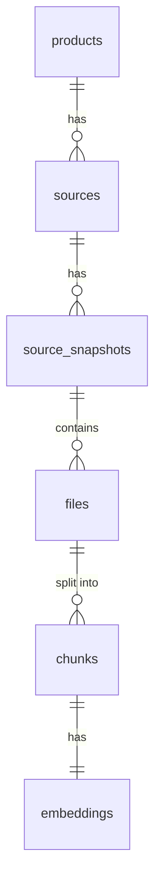

# 設計書

**システム名：社内リポジトリ向け RAG 基盤および Wiki 自動生成システム**

---

## 1. システムアーキテクチャ

### 1.1 全体構成

```mermaid
graph TB
    subgraph CI["CI/CD (GitLab CI)"]
        CI_Pipeline[Pipeline]
    end

    subgraph DevRag["dev-rag System"]
        HTTPServer[HTTP Server<br/>Port 8080]
        Indexer[Indexer]
        WikiGen[Wiki Generator]
        JobManager[Job Manager<br/>Memory]
        Postgres[(PostgreSQL<br/>+ pgvector)]
    end

    subgraph WikiViewer["wiki-viewer (Next.js)"]
        NextJS[Next.js<br/>Port 3000]
    end

    subgraph External["External APIs"]
        OpenAI[OpenAI<br/>Embeddings]
        LLM[LLM API<br/>OpenAI/Claude]
    end

    subgraph Storage["File Storage"]
        Repos[/var/lib/dev-rag/repos]
        Wikis[/var/lib/dev-rag/wikis]
    end

    CI_Pipeline -->|POST /api/v1/sources/index| HTTPServer
    NextJS -->|GET/POST /api/v1/*| HTTPServer
    HTTPServer -->|trigger| Indexer
    HTTPServer -->|trigger| WikiGen
    HTTPServer -->|query| Postgres
    HTTPServer -->|status| JobManager

    Indexer -->|clone/pull| Repos
    Indexer -->|embed| OpenAI
    Indexer -->|store vectors| Postgres

    WikiGen -->|query vectors| Postgres
    WikiGen -->|generate| LLM
    WikiGen -->|write md files| Wikis

    NextJS -->|read md files| Wikis
```

### 1.2 コンポーネント構成

本システムは以下のコンポーネントで構成される：

1. **HTTP サーバ**（Go実装、ポート 8080）
   - REST API エンドポイント提供
   - 非同期ジョブ管理（Goルーチン）
   - インデックス処理・Wiki生成のトリガー

2. **CLI ツール**（Go実装）
   - インデックス処理コマンド（リポジトリ自動登録含む）
   - Wiki生成コマンド
   - サーバ起動コマンド

3. **wiki-viewer**（Next.js、ポート 3000）
   - ダッシュボード（リポジトリ一覧）
   - Wiki 表示（Markdown + Mermaid レンダリング）
   - Wiki 再生成トリガー

4. **データストア**（PostgreSQL + pgvector）
   - リポジトリメタデータ
   - スナップショット情報
   - ファイル・チャンク情報
   - Embeddingベクトル
   - Wiki メタデータ

5. **外部API連携**
   - OpenAI Embeddings API（ベクトル生成）
   - LLM API（Wiki生成）

### 1.3 推奨ディレクトリ構成

#### ソースコード（現行アーキテクチャ）
```
dev-rag/
├── cmd/
│   └── dev-rag/            # CLI エントリポイント
├── internal/               # 内部実装（非公開パッケージ）
│   ├── interface/          # インターフェース層
│   │   ├── cli/            # CLIコマンド定義
│   │   └── http/           # HTTPハンドラ
│   ├── module/             # ドメインモジュール（境界づけられたコンテキスト）
│   │   ├── indexing/       # インデックス管理モジュール
│   │   │   ├── domain/     # ドメインモデルとインターフェース
│   │   │   ├── application/# アプリケーションサービス
│   │   │   └── adapter/pg/ # PostgreSQLアダプター（sqlc生成コード含む）
│   │   ├── search/         # 検索モジュール
│   │   ├── wiki/           # Wiki生成モジュール
│   │   └── llm/            # LLMクライアントモジュール
│   └── platform/           # 横断的関心事
│       ├── config/         # 設定管理
│       ├── database/       # データベース接続・トランザクション
│       └── container/      # DIコンテナ
├── pkg/                    # 公開可能な汎用パッケージ（レガシー、段階的移行中）
│   ├── indexer/            # インデックス処理
│   ├── search/             # ベクトル検索
│   ├── wiki/               # Wiki生成
│   └── ...
├── schema/                 # DBスキーマ定義
├── wiki-viewer/            # Next.js プロジェクト
│   ├── app/
│   ├── components/
│   └── lib/
└── docs/                   # ドキュメント
```

**アーキテクチャの特徴**:
- レイヤードアーキテクチャ（Interface → Application → Domain → Adapter）
- 境界づけられたコンテキスト（indexing, search, wiki, llm）
- 依存性逆転（ドメイン層がアダプター層に依存しない）
- pkg/ から internal/module/ への段階的移行

#### デプロイ先
```
/usr/local/dev-rag/
├── bin/
│   └── dev-rag          # Goバイナリ
└── wiki-viewer/         # Next.js Webアプリ
    ├── .next/
    ├── node_modules/
    └── package.json

/etc/dev-rag/
└── config.yaml          # 設定ファイル

/var/lib/dev-rag/
├── repos/               # Gitクローン先
│   ├── myapp/
│   └── another-service/
└── wikis/               # 生成されたWiki
    ├── myapp/
    └── another-service/

/var/log/dev-rag/
└── server.log           # ログ
```

**注:** 実装時は上記構成に従う必要はなく、実装者の判断で最適な構成を選択すること。

---

## 2. データモデル設計

### 2.1 エンティティ関係



### 2.2 主要テーブル

詳細なスキーマ定義は [database-schema.md](database-schema.md) を参照。

#### products（プロダクト）
- プロダクトの基本情報（名前、説明）
- 複数のソースをグループ化する単位
- 一意制約: name
- **Wiki生成はプロダクト単位で行うことを推奨**

#### sources（情報ソース）
- 情報ソースの基本情報（名前、ソースタイプ、メタデータ）
- ソースタイプ: git, confluence, pdf, redmine, notion, local
- 一意制約: name
- 外部キー: product_id (products.id) - 1つのプロダクトに複数のソースを紐付け可能
- **初期フェーズでは git のみを実装**

#### source_snapshots（ソーススナップショット）
- ソースの特定バージョン時点のスナップショット
- 一意制約: (source_id, version_identifier)
- バージョン識別子: Gitの場合はcommit_hash、Confluenceの場合はpage_version等
- インデックス済みフラグと完了日時を管理

#### files（ファイル・ドキュメント）
- スナップショット内のファイル・ドキュメント情報
- ファイル内容のハッシュ（SHA-256）を保持
- MIMEタイプ形式でコンテンツ種別を保持（例: text/x-go, text/markdown, application/pdf）

#### chunks
- ファイルを分割したチャンク
- 行番号範囲とテキスト内容を保持
- トークン数を記録

#### embeddings
- チャンクのEmbeddingベクトル（1536次元）
- pgvectorのIVFFlatインデックスで高速検索

---

## 3. 機能設計

### 3.1 CLI コマンド仕様

#### 3.1.1 product コマンド

**目的:** プロダクトを管理する

**サブコマンド:**

##### product list
```bash
dev-rag product list
```

プロダクト一覧を表示

##### product show
```bash
dev-rag product show --name <product-name>
```

プロダクト詳細と所属ソース一覧を表示

#### 3.1.2 source コマンド

**目的:** ソースメタデータを管理する（一覧・詳細表示）

**サブコマンド:**

##### source list
```bash
dev-rag source list [--product <product-name>]
```

ソース一覧を表示（プロダクト指定で絞り込み可能）

##### source show
```bash
dev-rag source show --name <source-name>
```

ソース詳細を表示

> インデックス作成は `index` コマンドで実行する

#### 3.1.3 index コマンド

**目的:** 各種ソースのインデックス化を実行する

**サブコマンド:**

##### index git
```bash
dev-rag index git --url <git-url> --name <source-name> --product <product-name> [options]
```

**オプション:**
- `--url`: GitリポジトリURL（必須）
- `--name`: ソース名（省略時は Git URL の末尾から自動決定）
- `--product`: プロダクト名（**必須**、プロダクトが存在しない場合は自動作成される）
- `--ref`: ブランチ名またはタグ名（省略時はリモートのdefault_branch）
- `--force-init`: 強制的にフルインデックスを実行（既存データを削除して再構築）

**動作:**

1. **プロダクト自動作成・ソース登録/更新**
   - プロダクトが存在しない場合は自動作成される
   - ソース名で検索し、存在すれば更新、なければ新規作成
   - メタデータに `{"url": "<git-url>", "default_branch": "<branch>"}` を保存

2. **インデックス処理（自動判断）**
   - デフォルト: 前回スナップショットがあれば差分更新、なければフルインデックス
   - `--force-init` 指定時: 既存データを削除して強制的にフルインデックス

3. **処理フロー**
   - Git clone/pull (`/var/lib/dev-rag/sources/<source-name>` 配下)
   - ファイル一覧取得（除外ルール適用: .gitignore → .devragignore）
   - チャンク化
   - Embedding生成（OpenAI API）
   - DB保存

4. **差分更新の仕組み**
   - 同一ソース・同一参照で最後に成功したスナップショットを検索
   - ファイルの `content_hash` で変更検出
   - 差分判定の詳細:
     - **新規ファイル**: 前回に存在しない → インデックス作成
     - **削除ファイル**: 新版に存在しない → cascade削除（files削除→chunks/embeddings自動削除）
     - **変更ファイル**: content_hashが異なる → chunks/embeddings削除後、再インデックス
     - **リネーム**: 削除+追加として扱う（ハッシュ一致でも再インデックス）

**使用例:**
```bash
# ECサイトプロダクトにバックエンドとフロントエンドのGitソースを登録してインデックス
dev-rag index git --url git@gitlab.com:company/backend.git --name backend-api --product ecommerce
dev-rag index git --url git@gitlab.com:company/frontend.git --name frontend-web --product ecommerce
dev-rag index git --url git@gitlab.com:company/infra.git --name infra --product ecommerce
```

##### index confluence（将来実装）
```bash
dev-rag index confluence --name <source-name> --product <product-name> [options]
```

##### index pdf（将来実装）
```bash
dev-rag index pdf --name <source-name> --product <product-name> [options]
```

#### 3.1.4 wiki generate コマンド

**目的:** プロダクト単位でMarkdown形式のWikiを生成する

**コマンド:**
```bash
dev-rag wiki generate --product <product-name> [options]
```

**オプション:**
- `--product`: プロダクト名（必須）
- `--out`: 出力ディレクトリ（省略時は `/var/lib/dev-rag/wikis/<product-name>`）
- `--config`: Wiki生成設定ファイル（省略時はデフォルト設定を使用）

**動作:**

1. **プロダクト情報取得**
   - プロダクトに属する全ソースを取得
   - 各ソースの最新インデックス済みスナップショットを取得

2. **ベクトル検索（プロダクト横断）**
   - 設定ファイルで定義されたページごとにクエリを実行
   - プロダクトの全ソースから関連するチャンクを取得（Top-K）
   - 各ソースの最新インデックス済みスナップショットを対象とする

3. **LLM生成**
   - 取得したチャンクをコンテキストとしてLLMに渡す
   - Markdown形式（Mermaid図を含む）で生成

4. **ファイル出力**
   - `/var/lib/dev-rag/wikis/<product-name>/` ディレクトリに出力
   - 既存ファイルは強制上書き（再現性保証）

**使用例:**
```bash
# ECサイトプロダクトのWikiを生成（各ソースの最新スナップショットを使用）
dev-rag wiki generate --product ecommerce
```

#### 3.1.5 server start コマンド

**目的:** HTTP サーバを起動する

**コマンド:**
```bash
dev-rag server start [options]
```

**オプション:**
- `--env`: 環境変数ファイルパス（デフォルト: `.env`）
- `--port`: HTTPポート（デフォルト: 8080、環境変数で上書き可能）

**動作:**

1. **設定ファイル読み込み**
   - .env形式の設定ファイルを読み込む
   - 環境変数で設定を上書き可能（例: `DB_PASSWORD`, `OPENAI_API_KEY`）

2. **HTTP サーバ起動**
   - ポート 8080（またはカスタム指定）で起動
   - REST API エンドポイントを提供
   - 認証ミドルウェアを有効化（Bearer Token）

3. **シグナル処理**
   - SIGTERM/SIGINT を受信時、実行中のジョブを完了させてから正常終了
   - 新規リクエストの受付を停止し、既存ジョブの完了を待つ（最大30秒）

**生成されるページと必須要素:**
- `index.md`: リポジトリ概要と目次
  - 主要コンポーネントサマリー
  - **必須: 最新コミット情報（ハッシュ、日時、メッセージ）**
- `architecture.md`: アーキテクチャと依存関係
  - **必須: 最低1つのMermaid図（flowchart/sequence/component等）**
- `features/<feature-name>.md`: 機能別詳細（設定ファイルで定義）
  - **必須: 機能の責務説明**
  - **必須: 主要ファイル一覧**
  - **推奨: 機能内フローを表したMermaid図**

### 3.2 チャンク化の設計方針

#### 3.2.1 パラメータ

| パラメータ | 値 | 説明 |
|-----------|------|------|
| 目標トークン数 | 800 | チャンクの目標サイズ |
| 最大トークン数 | 1,200 | これを超えた場合は強制分割 |
| 最小トークン数 | 100 | これ以下は前のチャンクに結合 |
| オーバーラップ | 200トークン | 前後のチャンクとの重複部分 |

#### 3.2.2 分割方針

**Markdown/テキスト:**
- 見出し単位で分割を優先
- 見出しがない場合は段落単位

**ソースコード:**
- 関数/クラス境界を考慮
- 構造解析が困難な場合は行数ベースで分割

**実装上の要件:**
- チャンクには開始行・終了行番号を記録
- オーバーラップ部分も明示的に管理
- トークン数は事前推定（正確な値は不要）

### 3.3 ベクトル検索の設計方針

#### 3.3.1 検索要件

**必須機能:**
- プロダクト単位またはソース単位でフィルタリング
- 参照（ブランチ/コミット/バージョン）でフィルタリング
- クエリ文字列からベクトル検索
- 結果件数の制限（Top-K）

**オプション機能:**
- パスプレフィックスでフィルタ
- コンテンツタイプでフィルタ（MIMEタイプ: text/x-go, text/markdown等）
- 前後のチャンクをコンテキストとして取得

#### 3.3.2 検索結果

各検索結果に含める情報：
- ファイルパス
- 開始行・終了行
- チャンク内容
- スコア（類似度）
- 前後のコンテキスト（オプション）

**スコアリング仕様:**
- 算出式: `score = 1 - cosine_distance`
- 範囲: 0.0（完全不一致）〜 1.0（完全一致）
- 並び順: スコア降順（デフォルト）

**コンテキスト設定:**
- 前後コンテキスト: デフォルト 1チャンク（前1+後1）
- 設定範囲: 0〜3チャンク
- 0の場合はヒットチャンクのみ返却

### 3.4 Wiki生成の設計方針

**基本方針:**
- **ベース**: deepwiki-open プロジェクトの疑似クエリ・プロンプト構造を採用
- **出力形式**: GitHub Flavored Markdown
- **Mermaid図**: 必ず ` ```mermaid ` ブロックで囲むこと
- **言語**: 日本語のみ

#### 3.4.1 生成ページ定義

**ページ構成:**
以下のページを生成する：

1. **index.md（概要ページ）:**
   - 内容: プロダクト/ソース概要、目次、主要コンポーネントサマリー
   - 疑似クエリ: 「このプロダクト/ソースの目的、主要機能、技術スタック、ディレクトリ構成を説明する」
   - 検索チャンク数: 20
   - 検索対象: 全ファイル（プロダクトの場合は全ソース横断）
   - 必須要素: 最新バージョン情報（Gitの場合はコミットハッシュ、日時、メッセージ）

2. **architecture.md（アーキテクチャページ）:**
   - 内容: システム全体構成、依存関係、メッセージフロー
   - 疑似クエリ: 「システムアーキテクチャ、コンポーネント間の依存関係、データフロー、技術的な設計判断を説明する」
   - 検索チャンク数: 25
   - 検索対象: 全ファイル（プロダクトの場合は全ソース横断）
   - 必須要素: Mermaid図（flowchart/sequence等）を最低1つ含む

3. **features/<feature-name>.md（機能別詳細、Gitソースの場合）:**
   - 内容: 各機能ごとの責務、主なファイル
   - 疑似クエリ: 「<機能名>の責務、実装詳細、関連ファイル、処理フローを説明する」
   - 検索チャンク数: 15
   - 検索対象: 該当機能のディレクトリ配下（パスフィルタ使用）、コンテンツタイプ=ソースコード系（text/x-*）
   - 推奨要素: 機能内のフローを表したMermaid図

**機能別ページの対象（Gitソースの場合）:**
- ソースの主要ディレクトリ（例: `pkg/indexer`, `pkg/search`, `pkg/wiki`等）ごとに1ページ生成
- 対象ディレクトリは、ソース構造を解析して自動的に判定するか、設定で指定可能

**疑似クエリ（Pseudo Query）の活用:**
- 単純な検索語ではなく、生成したい内容を表現する文章をクエリとして使用
- これにより、より適切なコンテキストをRAGで検索できる

#### 3.4.2 プロンプト設計

**システムプロンプトの構造:**
```
<role>
あなたは{target_name}（プロダクトまたはソース）の専門的なコード分析者です。
提供された情報を元に、日本語で正確で包括的なドキュメントを作成します。
</role>

<guidelines>
- 提供されたコンテキストのみに基づいて回答する
- 推測や憶測を含めない
- Markdown形式で構造化された出力を生成する
- コードブロックには適切な言語指定を使用する
- Mermaid図を含める場合は ```mermaid ブロックで囲む
- ファイルパスを参照する際は `inline code` フォーマットを使用する
</guidelines>

<style>
- 簡潔で技術的な表現を使用
- 見出しを使って情報を階層化
- 重要な情報には**太字**や*イタリック*を使用
- 表形式データはMarkdownテーブルで表現
</style>
```

**ユーザープロンプトの構造:**
```
<START_OF_CONTEXT>
{取得したチャンクをファイルパス別にグループ化して列挙}
各チャンク:
  File Path: {file_path}
  Content: {chunk_text}
<END_OF_CONTEXT>

<START_OF_USER_PROMPT>
{page_query}
<END_OF_USER_PROMPT>
```

#### 3.4.3 LLM呼び出し仕様

**要件:**
- プロバイダー: OpenAI API または Claude API（設定で切り替え可能）
- デフォルトパラメータ:
  - Temperature: 0.2
  - Max Output Tokens: 2048
  - Response Format: markdown（OpenAI APIの場合）
- Mermaid コードは ` ```mermaid ` ブロックで囲むことを必須とする

**コンテキスト管理:**
- RAGで取得したチャンクをファイルパス別にグループ化
- 各ファイルパスをヘッダーとして明示
- チャンク間の関係性を保持

**エラーハンドリング:**
- トークン制限超過時: チャンク数を減らして再試行（最大3回）
- API エラー時: 指数バックオフでリトライ（最大3回）
- 生成失敗時: エラーログを出力し、該当ページをスキップ

#### 3.4.4 出力後処理

**Markdown検証:**
- Mermaid図の構文チェック
- リンク切れチェック
- 見出し階層の検証

**ファイル出力:**
- 既存ファイルは強制上書き（再現性保証）
- UTF-8エンコーディング
- ファイルパーミッション: 644

---

## 4. REST API設計

### 4.1 エンドポイント概要

HTTPサーバは以下のカテゴリのREST APIを提供する：

1. **プロダクト・ソース情報**
  - `GET /api/v1/products`: プロダクト一覧
  - `GET /api/v1/products/:productId`: プロダクト詳細
  - `GET /api/v1/sources`: ソース一覧
  - `GET /api/v1/sources/:sourceId`: ソース詳細
  - `GET /api/v1/products/:productId/sources`: プロダクト配下のソース一覧

2. **非同期処理トリガー**
  - `POST /api/v1/sources/index`: ソースインデックス更新（ボディで `sourceName` を指定）
  - `POST /api/v1/products/wiki`: プロダクトWiki生成（ボディで `productName` を指定）

3. **ジョブ管理**
   - `GET /api/v1/jobs/:jobID`: ジョブステータス確認

4. **Wiki情報・ファイル取得（プロダクト単位のみ）**
  - `GET /api/v1/products/:productId/wiki`: プロダクトWiki情報
  - `GET /api/v1/products/:productId/wiki/files`: プロダクトWikiファイル一覧
  - `GET /api/v1/products/:productId/wiki/files/:path`: プロダクトWikiファイル取得

詳細な仕様（リクエスト/レスポンス形式、エラーハンドリング等）は [api-interface.md](api-interface.md) を参照。

### 4.2 非同期処理の設計

**基本フロー:**
1. クライアントがPOSTリクエストを送信
2. サーバは即座にジョブIDを返却（202 Accepted）
3. バックグラウンドでGoルーチンが処理を実行
4. クライアントは `GET /api/v1/jobs/:jobID` でステータスをポーリング

**ジョブ管理:**
- メモリ内で管理（sync.Map使用）
- 24時間経過後に自動削除
- サーバ再起動時は失われる（開発環境のため許容）

### 4.3 認証・セキュリティ

- Bearer Token 認証
- トークンは環境変数 `DEVRAG_API_TOKEN` で設定

---

## 5. 非機能設計

### 5.1 設定管理

**.env ファイルで管理:**

```bash
# Database
DB_HOST=localhost
DB_PORT=5432
DB_USER=devrag
DB_PASSWORD=secret
DB_NAME=devrag
DB_SSLMODE=disable

# API Authentication
DEVRAG_API_TOKEN=your-secret-token

# OpenAI (for Embeddings)
OPENAI_API_KEY=sk-xxx
OPENAI_EMBEDDING_MODEL=text-embedding-3-small
OPENAI_EMBEDDING_DIMENSION=1536

# LLM for Wiki Generation
WIKI_LLM_PROVIDER=openai  # openai or anthropic
WIKI_LLM_API_KEY=sk-xxx  # OpenAI or Anthropic API key (depending on provider)
WIKI_LLM_MODEL=gpt-4-turbo-preview  # or claude-3-5-sonnet-20241022
WIKI_LLM_TEMPERATURE=0.2
WIKI_LLM_MAX_TOKENS=2048

# Git
GIT_CLONE_DIR=/var/lib/dev-rag/repos
GIT_SSH_KEY_PATH=/etc/dev-rag/ssh/id_rsa
GIT_SSH_KNOWN_HOSTS=/etc/dev-rag/ssh/known_hosts

# Wiki Output
WIKI_OUTPUT_DIR=/var/lib/dev-rag/wikis

# Server
HTTP_PORT=8080
```

### 4.2 エラーハンドリング

**リトライポリシー:**
- OpenAI API: 429/500エラー時に最大3回リトライ（exponential backoff）
- DB接続: 接続失敗時に最大3回リトライ

**ログ出力:**
- 形式: JSON構造化ログ
- レベル: INFO, WARN, ERROR
- 出力先: stdout

### 4.3 同時実行制御

**要件:**
- 同一リポジトリ・同一参照に対するインデックス処理は排他制御
- PostgreSQLのアドバイザリロックを使用

### 4.4 パフォーマンス最適化

**Embeddingバッチ処理:**
- 複数チャンクをまとめてOpenAI APIに送信
- バッチサイズ: 最大100チャンク/リクエスト
- 並列度: 最大5並列リクエスト

**pgvectorインデックス:**
- インデックスタイプ: IVFFlat
- `lists` パラメータ: sqrt(総チャンク数) を目安に調整

---

## 6. CI/CD統合設計

### 6.1 GitLab CI パイプライン想定

**.gitlab-ci.yml 例:**

```yaml
stages:
  - trigger

trigger-devrag:
  stage: trigger
  only:
    - main
  script:
    - |
      # dev-rag サーバの REST API を呼び出し
      curl -X POST http://devrag.example.com:8080/api/v1/sources/index \
        -H "Authorization: Bearer $DEVRAG_API_TOKEN" \
        -H "Content-Type: application/json" \
        -d '{
          "sourceName": "backend-api",
          "ref": "main",
          "commitHash": "'$CI_COMMIT_SHA'",
          "generateWiki": true
        }'
```

**処理フロー:**
1. GitLab CI が main ブランチへのマージを検知
2. パイプラインが dev-rag サーバの REST API を呼び出し
3. サーバは即座にジョブ ID を返却し、パイプラインは完了
4. サーバ側でバックグラウンドでインデックス更新と Wiki 生成を実行
5. Wiki は `/var/lib/dev-rag/wikis/myapp/` に出力される

**運用上の要件:**
- `DEVRAG_API_TOKEN` を GitLab CI/CD Variables で管理
- dev-rag サーバは常時起動（systemd で管理）
- wiki-viewer で生成された Wiki をいつでも閲覧可能

---

## 7. セキュリティ設計

### 7.1 認証情報管理

- **OpenAI APIキー**: 環境変数 `OPENAI_API_KEY`（Embedding生成に必須）
- **Wiki生成用LLM APIキー**: 環境変数 `WIKI_LLM_API_KEY`（`WIKI_LLM_PROVIDER` で指定したプロバイダーのAPIキー）
- **DB接続情報**: 環境変数
- **Git認証**: SSH鍵をシステムに配置
  - **配置場所**: `/etc/dev-rag/ssh/id_rsa`（秘密鍵）、`/etc/dev-rag/ssh/id_rsa.pub`（公開鍵）
  - **known_hosts**: `/etc/dev-rag/ssh/known_hosts`
  - **パーミッション**: `0600`（所有者のみ読み書き可能）
  - **所有者**: サービス実行ユーザー（例: `devrag`）
  - **推奨**: 社内Gitサーバー専用のSSH鍵を作成

設定ファイル例 (`.env`):
```bash
# Git SSH Configuration
GIT_SSH_KEY_PATH=/etc/dev-rag/ssh/id_rsa
GIT_SSH_KNOWN_HOSTS=/etc/dev-rag/ssh/known_hosts
```

**セキュリティ要件:**
- SSH鍵ファイルは `0600` パーミッションで保護
- SSH鍵パスや内容をログに出力しない
- 環境分離: 認証情報は `/etc/dev-rag/` 配下に集約

### 7.2 データ保護

- **コード・ドキュメント**: 社内ネットワーク内でのみ扱う
- **外部送信**: OpenAI APIへのEmbeddingリクエストのみ
- **アクセス制御**: PostgreSQLのロール・権限で制御

---

## 8. テスト戦略

### 8.1 単体テスト

- 対象: 各パッケージの主要関数
- カバレッジ目標: 70%以上

### 8.2 統合テスト

- 対象: インデックス処理、ベクトル検索、Wiki生成
- 環境: Docker Composeでテスト用PostgreSQLを起動

### 8.3 E2Eテスト

**シナリオ:**
1. リポジトリ登録 → インデックス作成 → 検索実行 → 結果検証
2. Wiki生成 → ファイル出力確認 → Mermaid構文チェック

---

## 9. 将来拡張の設計方針

### 9.1 MCP サーバ実装

**プロトコル:** JSON-RPC over stdio

**提供ツール:**
- `rag-search`: ベクトル検索
- `get-file`: ファイル内容取得
- `list-repos`: リポジトリ一覧

**設計上の考慮点:**
- 検索APIを内部インターフェースとして共通化
- MCP サーバはCLIと同じ検索ロジックを再利用

### 9.2 RAG チャット API

**エンドポイント:** REST API

**機能:**
- セッション管理
- メッセージ履歴
- ストリーミング対応（Server-Sent Events）

---

## 10. 運用設計

### 10.1 初期セットアップ

1. PostgreSQL + pgvectorのインストール
2. DBマイグレーション実行
3. .envファイルの作成と配置
4. SSH鍵の配置とパーミッション設定
5. CLIインストール

### 10.2 日常運用

- **差分インデックス**: CI/CDで自動実行
- **フルインデックス**: 必要に応じて手動実行
- **DB監視**: ディスク使用量、クエリ性能

### 10.3 トラブルシューティング

**インデックス失敗時:**
1. ログ確認（JSON形式で出力）
2. OpenAI APIクォータ確認
3. DB接続確認
4. 必要に応じて `--force-init` で再実行

**検索結果が不正確な場合:**
1. Embeddingモデルの確認
2. チャンク化パラメータの調整
3. 検索クエリの見直し

---

## 11. まとめ

本設計書は、要件定義書に基づき、以下を定義した：

1. システムアーキテクチャと構成
2. データモデルの設計方針
3. CLI機能仕様と処理フロー
4. チャンク化・検索・Wiki生成の設計方針
5. 非機能要件（設定、エラーハンドリング、性能）
6. CI/CD統合方針
7. セキュリティとテスト戦略

**詳細な実装仕様:**
- データベーススキーマ: [database-schema.md](database-schema.md)
- API/インターフェース: [api-interface.md](api-interface.md)

**実装時の注意:**
- 本設計書は方針を示すものであり、実装の自由度を妨げるものではない
- 実装者は、本設計の意図を理解した上で、最適な実装方法を選択すること
- コード例は参考程度とし、実際の実装とは異なってもよい

**データモデルについて:**
- データモデルは複数の情報ソース（Git、Confluence、PDF等）に対応できる汎用的な設計
- 初期フェーズでは Git リポジトリのみを実装するが、将来の拡張を見据えた抽象化を採用
- `sources` / `source_snapshots` テーブルにより、ソースタイプごとの差異を吸収
